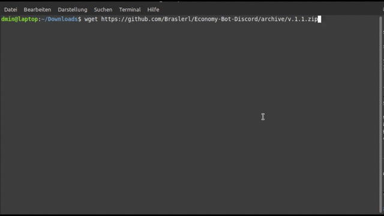
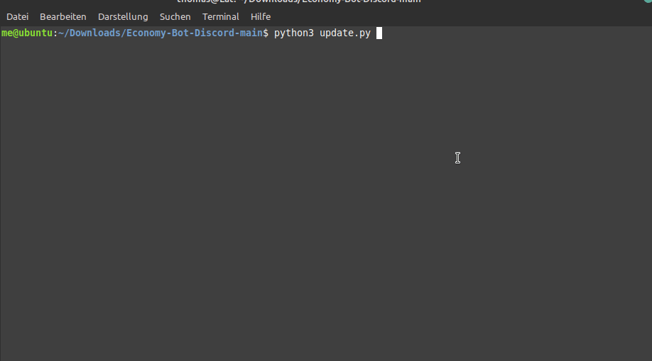

# Economy-Bot-Discord
Discord Bot, written in Python. It is using an file system to store data.

## Installation:
Clone this repository,unzip, put your token in "token.txt" and you can start it.
Here's an guide how you get an token: https://www.writebots.com/discord-bot-token/
Install all requirements with `pip3 install -r requirements.txt` (You have to be in the bot's folder)
And start it with: `python3 Discord_Economy_Bot.py`
And that's it.

## Future:

 - [ ] More items
 - [ ] More commands
 - [ ] More jobs

## Demo:

## Update:
Just run `update.py`, it will replace your old bot with the new version.

